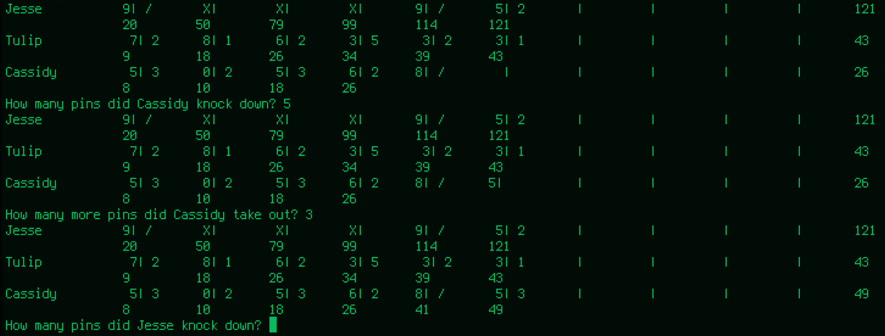

This is a Python program to track bowling scores.

There isn't a set number of players - just type each name, and type "end" when you've got everyone in.

Each turn, the program will print everyone's score card, and ask how many pins a player knocked down. A number 0-10 is entered.
The program then prints the updated score card and asks for the next number of pins knocked down.
The program will skip a player's second roll if a strike is reported, and correctly wait to score strikes and spares until data from the next frame is available.

Here's a secreenshot of the program running in a terminal:

This is a work-in-progress.
